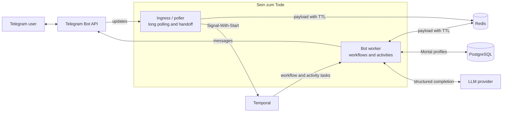

[](https://github.com/matyushinleonid/sein-zum-tode/actions/workflows/ci.yml)
[](https://t.me/SeinZumTodeBot)
[](https://www.python.org/)
[](LICENSE)

# Sein zum Tode

---

The topic of death remains largely taboo in today’s society (as noted, for example, by Philippe Ariès). This project is designed to help users face the inevitability of death as a phenomenon that will (and indeed **is**) happen to them.

Users are invited to answer a series of questions about their lifestyle, after which a rough estimate of their remaining lifespan is calculated by an LLM-based model. Of course, the resulting number of days left is not meant to be precisely accurate. The real value lies in the daily countdown of remaining days that the bot will send to the user.

---

- The current Telegram implementation is available as [SeinZumTode](https://t.me/SeinZumTodeBot)
- It runs in k8s.leonid.sh ([IaC repository](https://github.com/matyushinleonid/k8s.leonid.sh)). The ArgoCD application and related Kubernetes resources are available [here](https://github.com/matyushinleonid/k8s.leonid.sh/tree/main/argocd/sein-zum-tode).

## User interface

The bot asks a questionnaire about the user’s health, lifestyle, and background. An LLM uses the answers to estimate the number of days remaining, after which the bot sends a configurable countdown notification. The result is an intentionally rough reflection tool, not a medical prediction.

Questionnaire answers are never stored in PostgreSQL or Temporal history. They exist temporarily in Redis with a TTL, are used to generate the prediction, and are explicitly deleted after completion or expiration.

- `/begin` — start or restart the questionnaire.
- `/notifications` — configure notification schedule.
- `/localization` — choose Russian or English.
- `/help` — show usage instructions.
- `/about` — show project information and source code.

## High-level overview



- **Ingress** uses aiogram only as a lightweight Telegram Bot API transport/model wrapper, stores updates in Redis, and hands Redis keys to Temporal. The bot does not use aiogram dispatching or state machines.
- **Bot worker** runs Temporal Workflows and Activities, processes questionnaires, sends messages, and schedules notifications.
- **Redis** keeps sensitive payloads temporarily with TTL.
- **PostgreSQL** stores user profiles, preferences, death dates, and LLM quota.

The service is written in Python and uses aiogram, Temporal, Redis, PostgreSQL, SQLAlchemy, Alembic, Pydantic, OpenAI/Yandex AI Studio SDKs, Prometheus, Loki, Docker Compose, Helm, Kubernetes, and Argo CD.

Temporal is used instead of bot-specific state-machine frameworks because those frameworks do not provide Temporal’s durable execution, retries, recovery, and workflow-history guarantees.

## Local development

Docker Compose does not start Temporal. Forward an existing Temporal frontend first:

```shell
kubectl port-forward -n temporal svc/temporal-frontend 7233:7233
```

Containers reach the forwarded port at `host.docker.internal:7233`.

```shell
make install
make test       # run tests
make check      # run lint, type checking, and tests
make run
```
